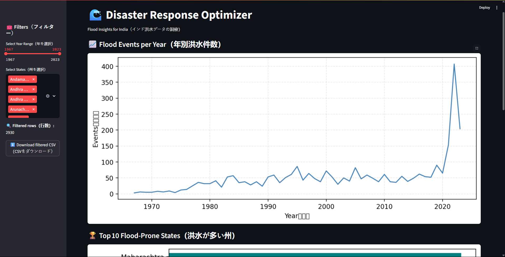

# 🌊 Disaster Response Optimizer (India Flood Analysis)

Hi! I'm Utkarsh Sharma, and this is a data analysis project I built to explore real-world flood events across India.  
The goal is to understand patterns in natural disasters so governments and communities can respond better in the future.

This project was built using:
- 🐍 Python (pandas, matplotlib, seaborn)
- 📊 Jupyter Notebooks (for analysis)
- 🖥️ VS Code & GitHub (version control)
- 📁 Publicly available flood data

---

## 🧪 What This Project Does

✔️ Cleans real flood event data from India (1967–2023)  
✔️ Analyzes flood duration, human fatalities, and state-wise trends  
✔️ Visualizes:
- Top 10 most flood-prone states  
- Year-by-year trend of events  
- Distributions of duration and death tolls  
✔️ Flags outliers (like extreme floods or high-fatality events)

Soon I’ll be turning this into an interactive dashboard using **Streamlit**!

---

## 📂 Folder Structure

```bash
disaster-response-optimizer/
├── data/
│   ├── raw/              # Original downloaded CSV
│   └── clean/            # Cleaned version used in analysis
├── notebooks/
│   ├── 01_data_loading.ipynb
│   └── 02_eda_overview.ipynb
├── .gitignore
└── README.md
